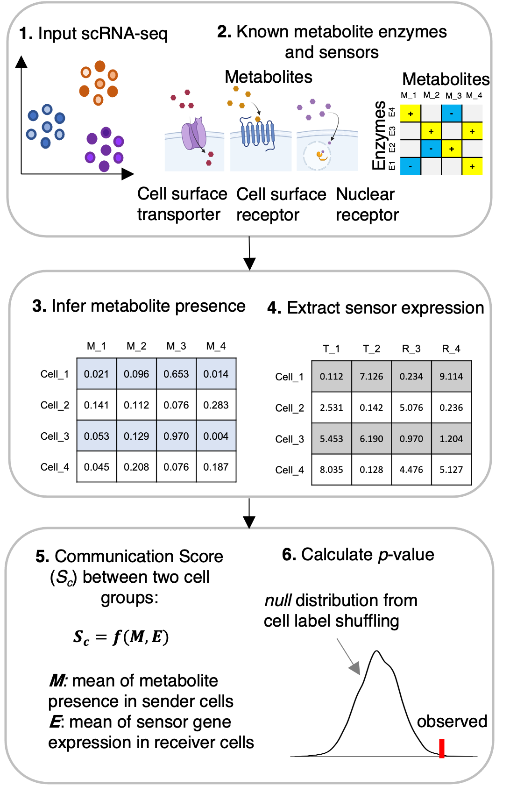

</img>

## Welcome to use MEBOCOST: <I>Me</I>ta<I>bo</I>lic Cell-Cell <I>Co</I>mmunication Modeling by <I>S</I>ingle Cell <I>T</I>ranscriptome

### What is MEBOCOST and hoe does it work?
<p>MEBOCOST is a Python-based computational tool for inferring metabolite, such as lipid, mediated cell-cell communication events using single-cell RNA-seq data. Briefly, in the first step, MEBOCOST imputes the relative abundance of metabolites based on the gene expression of metabolic reaction enzymes. The genes of enzymes were collected from Human Metabolome Database (HMDB). Next, MEBOCOST identifies cell-cell metabolite-sensor communications between cell groups, in which metabolite enzymes and sensors were highly expressed in sender and receiver cells, respectively.</p>

### Term of Usage
1. You agree NOT to make the MEBOCOST data (or any part thereof, modified or not) available to anyone outside your research group. "Make available" includes leaving the data where it may be accessible to outside individuals without your direct knowledge (e.g. on a computer to which people outside your group have login privileges), as well as directly providing it to someone.

2. You agree NOT to build another website and/or methods using the MEBOCOST data. Please contact us if you are going to.

3. You agree NOT to use the MEBOCOST data for proprietary analysis. You agree to properly cite the MEBOCOST papers and its specific, original contributions if directly related to your work.

4. You certify that you are authorized to accept this agreement on behalf of your institution.

5. All members of your group with access to the MEBOCOST data agree to the same conditions.


#### The Flowchart of MEBOCOST
<p>workflow for predicting metabolite mediated cell-cell communication (mCCC) taking scRNA-seq data as input.</p>
</img>

### Version control
<p>We keep updating MEBOCOST!!!</p>
<p><b>Added tutorial to integrate COMPASS software for mCCC analysis by constraining metabolite efflux and influx</b></p>
<li>Current release: 1.0.3</li>

- fixed bugs in background estimation
- automated cutoffs to exclude lowly ranked 25% sensors or metabolites across all cells, cutoffs can still be specified by users
- add parameters in plot functions, including show_num in eventnum_bar

<hr>

### Installation
* download and install miniconda enviroment (Users can skip this step if a python-based environment has been well-established)
```{bash}
wget https://repo.anaconda.com/miniconda/Miniconda3-latest-MacOSX-x86_64.sh && bash Miniconda3-latest-MacOSX-x86_64.sh

conda create -n mebocost python=3.8

conda activate mebocost
```
* download MEBOCOST package from github
```{bash}
git clone https://github.com/zhengrongbin/MEBOCOST.git

cd MEBOCOST
```
* install requirements
```{bash}
pip install -r requirements.txt
```
* install MEBOCOST
```{bash}
python setup.py install
```

### To re-install and upgrade by pip if you have existing MEBOCOST installed
```
pip uninstall mebocost
pip install git+https://github.com/zhengrongbin/MEBOCOST.git --upgrade
```


#### To check whether it has been installed sucessfully, users can run in python:
```{python}
>>from mebocost import mebocost
```
#### if the mebocost can be imported successfully, you can continue to do analyses by mebocost!

### Tutorial for MEBOCOST

<li><a href='./Demo_Communication_Prediction.ipynb' target='_blank'>Prediction of cell-cell metabolic communication by scRNA-seq data</a></li>
<!-- <li><a href='./Demo_Pathway_Inference.ipynb' target='_blank'>Inference of cell-cell metabolic communication associated pathways in receiver cells (in development and only Python3.8 supported)</a></li>
 -->
### Cite us
<p>Please cite us at <a href='https://www.biorxiv.org/content/10.1101/2022.05.30.494067v1' target='_blank'>bioRxiv</a> if you find MEBOCOST is useful to your project.</p>

### Contact
Rongbin.Zheng@childrens.harvard.edu

or

Kaifu.Chen@childrens.harvard.edu

<hr>
Copy Right @ Kaifu Chen Lab @ Boston Childrens Hospital / Harvard Medical School
