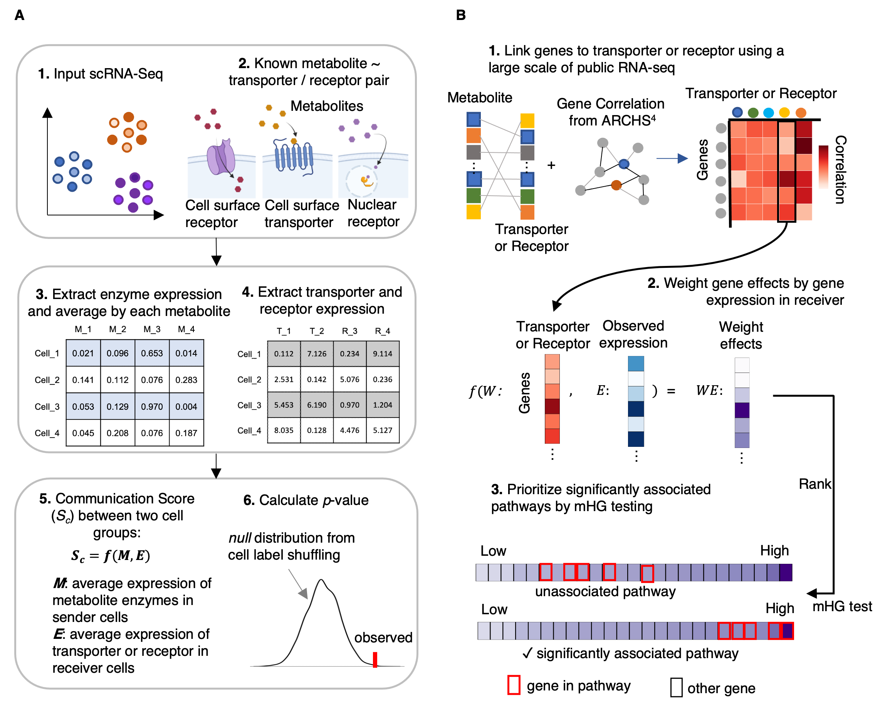

</img>

## Welcome to use MEBOCOST: <I>Me</I>ta<I>bo</I>lic Cell-Cell <I>Co</I>mmunication Analysis by <I>S</I>ingle Cell <I>T</I>ranscriptome

### 2020-05-22

### Version control
<li>Current release: 1.0.0</li>
<p>We keep updating MEBOCOST!!!</p>
<hr>

### What is MEBOCOST and hoe does it work?
<p>MEBOCOST is a Python-based computational tool for inferring metabolite mediated cell-cell communication events using single-cell RNA-seq data. Briefly, in the first step, MEBOCOST imputes the relative abundance of metabolites based on the gene expression of metabolic reaction enzymes. The genes of enzymes were collected from Human Metabolome Database (HMDB). Next, MEBOCOST identifies significant communication events between sender and receiver cells with assumption that the senders are highly abundant of metabolite, meanwhile, receivers highly express sensors (the metabolite corresponding receptor or uptaking transporter). Furthermore, MEBOCOST infers communication associated pathways in receiver cells, which we try to link cellular mechanism of receivers in response to the communication events.</p>

#### The Flowchart of MEBOCOST
<p>Panel A: workflow for predicting cell-cell metabolic communication events taking scRNA-seq data as input. Panel B for pathway association inference for the significant communication events.</p>
</img>

### Installation
* download and install miniconda enviroment (Users can skip this step if a well python-based environment has been established)
```{bash}
wget https://repo.anaconda.com/miniconda/Miniconda3-latest-MacOSX-x86_64.sh && bash Miniconda3-latest-MacOSX-x86_64.sh

conda create -n mebocost python=3.8

conda activate mebocost
```
* download MEBOCOST package from github
```{bash}
git clone https://github.com/zhengrongbin/MEBOCOST.git

cd MEBOCOST
```
* install requirements
```{bash}
pip install -r requirements.txt
```
* install MEBOCOST
```{bash}
python setup.py install
```
#### To check whether it has been installed sucessfully, users can run in python:
```{python}
>>from mebocost import mebocost
```
#### if the mebocost can be imported successfully, you can continue to do analyses by mebocost!

### Tutorial for MEBOCOST

<li><a href='./Demo_Communication_Prediction.ipynb' target='_blank'>Prediction of cell-cell metabolic communication by scRNA-seq data</a></li>
<li><a href='./Demo_Pathway_Inference.ipynb' target='_blank'>Inference of cell-cell metabolic communication associated pathways in receiver cells</a></li>

### Contact
Rongbin.Zheng@childrens.harvard.edu

or

Kaifu.Chen@childrens.harvard.edu

<hr>
Copy Right @ Kaifu Chen Lab @ Boston Childrens Hospital / Harvard Medical School
