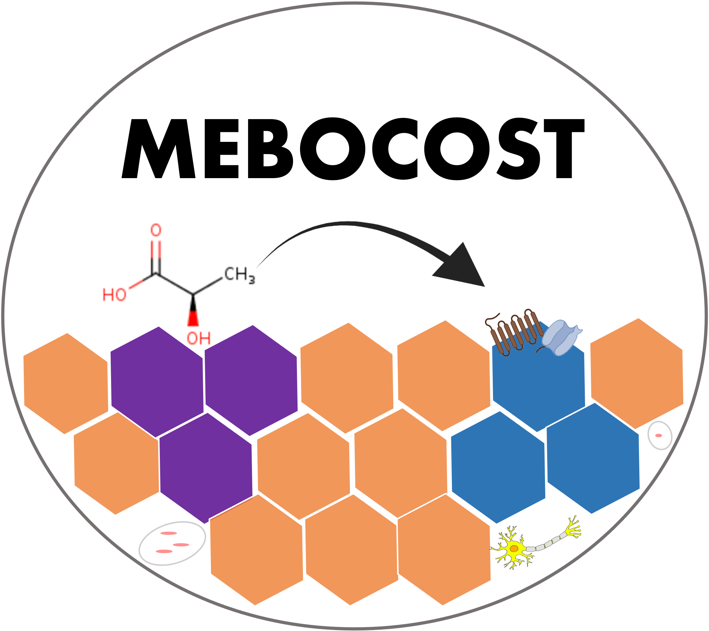
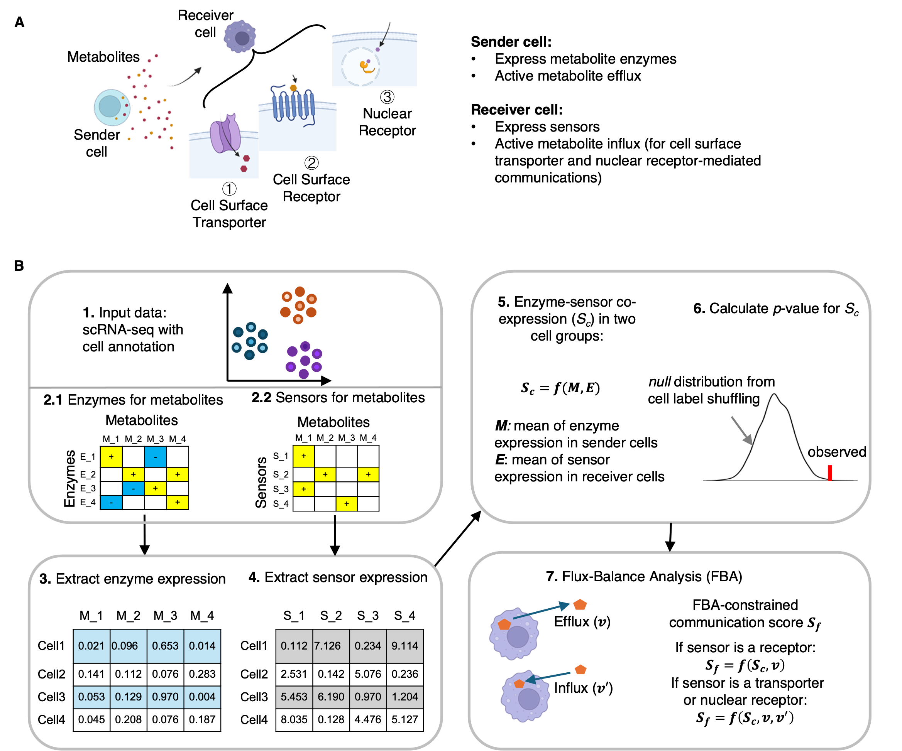

</img>

## Welcome to use MEBOCOST: <I>Me</I>ta<I>bo</I>lic Cell-Cell <I>Co</I>mmunication Modeling by <I>S</I>ingle Cell <I>T</I>ranscriptome

### What is MEBOCOST and how does it work?

<p>

MEBOCOST is a Python-based computational tool for inferring metabolite, such as lipid, mediated cell-cell communication events using single-cell RNA-seq data. MEBOCOST includes a manually curated database of metabolite-sensor partners and defines sender and receiver cells based on rates of metabolite efflux and influx, along with expression levels of enzyme and sensor genes, respectively.

</p>

### Term of Usage

1.  You agree NOT to make the MEBOCOST data (or any part thereof, modified or not) available to anyone outside your research group. "Make available" includes leaving the data where it may be accessible to outside individuals without your direct knowledge (e.g. on a computer to which people outside your group have login privileges), as well as directly providing it to someone.

2.  You agree NOT to build another website and/or methods using the MEBOCOST data. Please contact us if you are going to.

3.  You agree NOT to use the MEBOCOST data for proprietary analysis. You agree to properly cite the MEBOCOST papers and its specific, original contributions if directly related to your work.

4.  You certify that you are authorized to accept this agreement on behalf of your institution.

5.  All members of your group with access to the MEBOCOST data agree to the same conditions.

#### The Flowchart of MEBOCOST

<p>

workflow for predicting metabolite mediated cell-cell communication (mCCC) taking scRNA-seq data as input.

</p>

</img>

### Version control

<p>

We keep updating MEBOCOST!!!

</p>

<li>

Changelog for v1.0.4

</li>

-   Upgrade to up-to-date python version (3.12)
-   Integrate COMPASS software to constrain metabolite efflux and influx in mCCC analysis
-   Allow users to examine the relationship between communication score and blood metabolite concentration, if the blood metabolite data is available
-   Fix bugs for plotting, including remove_unrelevant parameter in network plot, subfigure arrangement in the flow plot, and dendrogram ordering in the dot plot.
-   Change lines to curves in the network plot, now it is easier to distinguish sending and receiving signals.
-   By default, only output significant mCCC events, rather than complete mCCC table (but still be available in original_table item)
-   Provide options to set the range of dot size and line width in all plots. This is useful when generating plots for different samples to compare.
-   Provide options to set orders for x and y axis, or rows and columns, in plots.
-   Add function to automatically check the format of expression matrix
-   deprecated pathway analysis as it will be moved to another module

<hr>

### Installation

-   download and install miniconda environment (Users can skip this step if a python-based environment has been well-established).

```{bash}
wget https://repo.anaconda.com/miniconda/Miniconda3-latest-Linux-x86_64.sh && bash Miniconda3-latest-Linux-x86_64.sh

conda create -n mebocost python=3.12

conda activate mebocost
```

-   download MEBOCOST package from github

```{bash}
git clone https://github.com/zhengrongbin/MEBOCOST.git

cd MEBOCOST
```

-   install requirements

```{bash}
pip install -r requirements.txt
```

-   install MEBOCOST

```{bash}
python -m pip install .
```

#### To check whether it has been installed successfully, you can run in python:

```{python}
>>from mebocost import mebocost
```

#### if the mebocost can be imported successfully, you are good!

### Tutorial

<li>

<a href='./Demo_Communication_Prediction.ipynb' target='_blank'>Prediction of cell-cell metabolic communication by scRNA-seq data</a>

</li>

### Cite us

<p>

Please cite us at <a href='https://www.biorxiv.org/content/10.1101/2022.05.30.494067v1' target='_blank'>bioRxiv</a> if you find MEBOCOST is useful to your project.

</p>

### Contact

[Rongbin.Zheng\@childrens.harvard.edu](mailto:Rongbin.Zheng@childrens.harvard.edu){.email}

or

[Kaifu.Chen\@childrens.harvard.edu](mailto:Kaifu.Chen@childrens.harvard.edu){.email}

<hr>

Copy Right \@ Kaifu Chen Lab \@ Boston Childrens Hospital / Harvard Medical School
